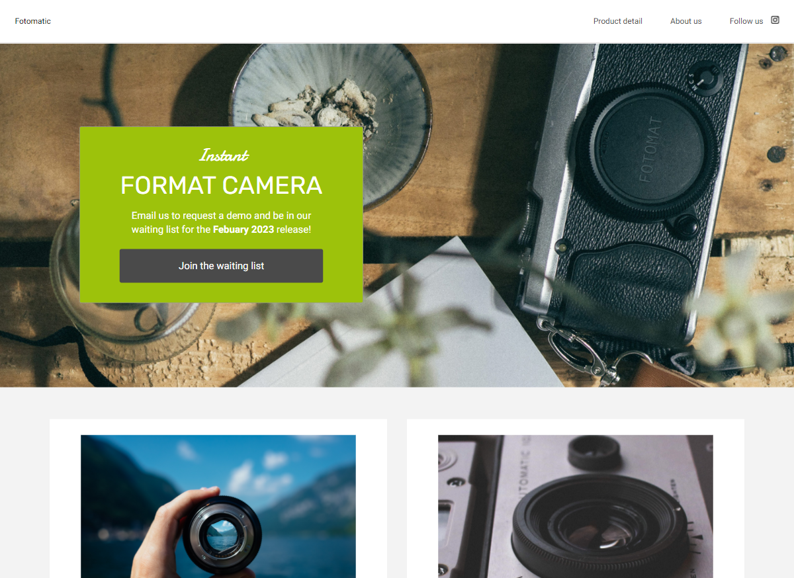
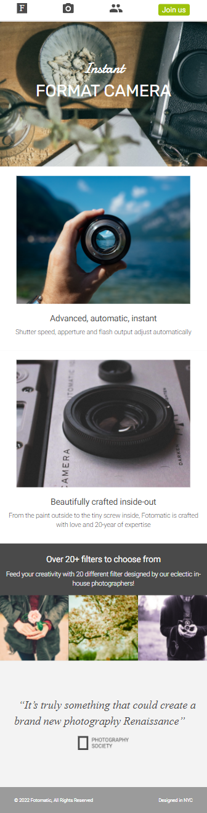

# Fotomatic

A Codecademy project in the Front-End-Engineer career path. 

## Description 
In this project, I fixed a broken version of a responsive website called Fotomatic. 
The website was updated to look and work exactly the same as the specs do.

## Snapshot

### Desktop

### Mobile

## Specs 
Check out the project specs [here](https://content.codecademy.com/courses/freelance-1/capstone-1/specs/fotomatic_spec_landing.png). 

## Link 
https://chloeharris1.github.io/fotomatic/

## Questions 
[Email Me](Chloe.a.harris17@gmail.com) if you have any questions.

Check out more of my work on [GitHub](https://github.com/chloeharris1).

