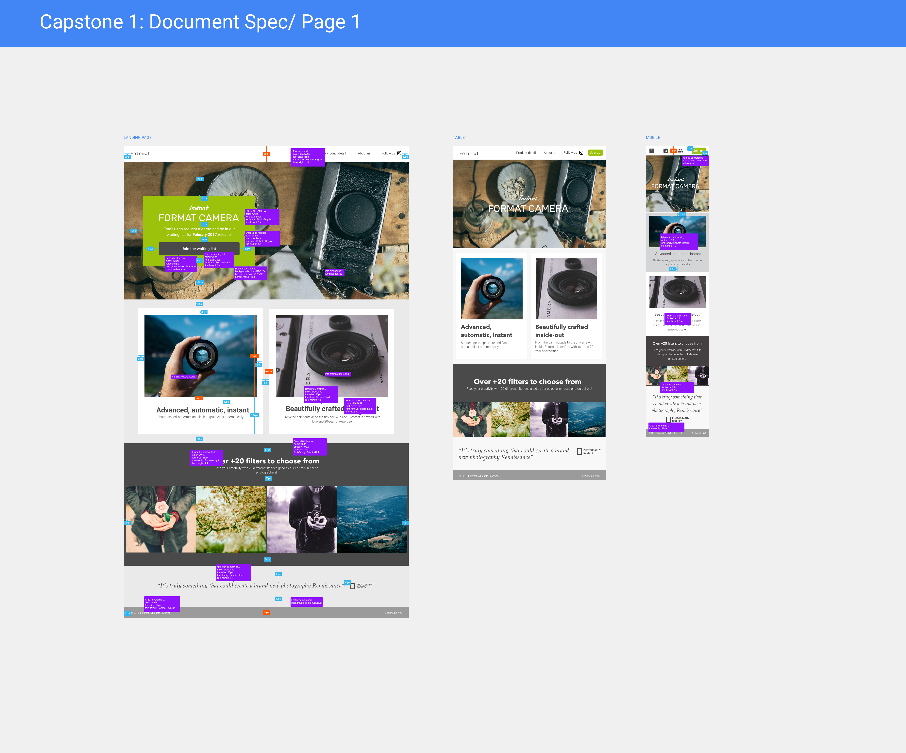

# Fotomatic

## Description 
In this project, I fixed a broken version of a responsive website called Fotomatic. 
The website was updated to look and work exactly the same as the specs do.

## Snapshots

## Specs 

## Questions 
[Email Me](Chloe.a.harris17@gmail.com) if you have any questions.

Check out more of my work on [GitHub](https://github.com/chloeharris1).

